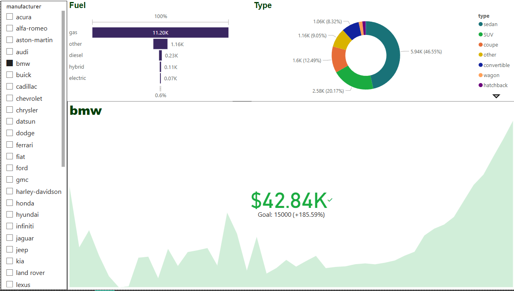

# car-price-prediction-xgboost
Predicting used car prices using Craigslist dataset and XGBoost regression with advanced feature engineering and cross-validation.


>📊 Interactive dashboard built in Power BI showcasing average car price by manufacturer, price trend over years, target comparison, fuel type distribution, and vehicle type breakdown.

# 🚗 Car Price Prediction Using XGBoost | Craigslist Cars Dataset

This project aims to predict used car prices based on features extracted from Craigslist vehicle listings. We use **XGBoost Regressor** and perform comprehensive preprocessing, feature engineering, and cross-validation to build a high-performance model.

---

## 📦 Dataset Overview

- **Source**: [Craigslist Cars and Trucks Data on Kaggle](https://www.kaggle.com/datasets/austinreese/craigslist-carstrucks-data)
- **Total Records**: 400,000+ vehicle listings
- **Columns**:
  - `price`, `year`, `manufacturer`, `model`, `condition`, `cylinders`, `fuel`, `odometer`, `title_status`, `transmission`, `drive`, `type`, `paint_color`, `state`, `posting_date`

---

## 🎯 Problem Statement

The goal is to build a regression model to accurately predict the **selling price** of a car given its attributes.

We use **log-transformed price (`log_price`)** as the target variable to stabilize variance and improve model performance.

---

## 🧠 Modeling Approach

- **Model Used**: `XGBoostRegressor`
- **Target Variable**: `log(price)`
- **Loss Metric**: Root Mean Squared Error (RMSE)

---

## 📊 Evaluation Results

| Split      | Log RMSE (CV) |
|------------|---------------|
| Train Set  | 0.2385        |
| Test Set   | 0.2299        |

---

## ⚙️ Pipeline Summary

### ✅ Data Preprocessing
- Dropped duplicates & handled missing values
- Filtered outliers based on price and odometer
- Log-transformed skewed features
- Encoded categorical variables with:
  - Ordinal Encoding (e.g., condition)
  - Frequency Encoding / Label Encoding (e.g., fuel, drive)

### ✅ Feature Engineering
- Combined features like `age = 2024 - year`
- Created `model_density` for common vehicle models
- Removed high-cardinality irrelevant columns like `posting_date`

### ✅ Modeling & Tuning
- Used **XGBoost** with early stopping
- Performed cross-validation (StratifiedKFold)
- Feature importance plot generated
- Final prediction scores converted from log-scale back to price

```

## 📁 Repository Structure

craigslist-car-price-xgboost/
├── 01_xgboost_regressor_car_price.ipynb  # 📓 Full notebook: EDA → Preprocessing → Modeling
├── README.md                             # 📘 Project overview and results


```

## 📚 Libraries Used

- `pandas`, `numpy`, `matplotlib`, `seaborn`
- `xgboost`
- `scikit-learn`

---

## 💡 Future Work

- Hyperparameter tuning using `Optuna`
- Deployment using Streamlit or FastAPI
- SHAP/ELI5 for explainability

---

## 👤 Author

**Rahul Arya**  
Aspiring Data Scientist | B.Sc. Physics | IBM & Stanford ML Certified  


---

## ✅ Acknowledgements

- **Kaggle Datasets** – For providing high-quality car listings  
- **XGBoost & scikit-learn** – For enabling fast model development  
- **Community Notebooks** – Inspiration for preprocessing techniques  

